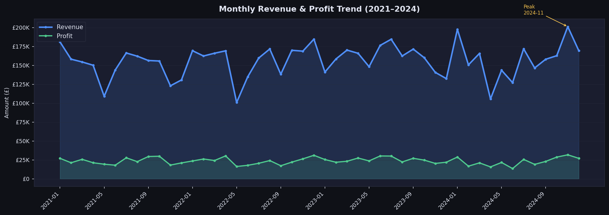
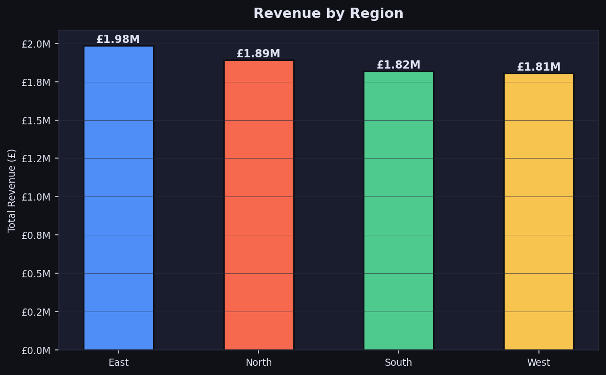
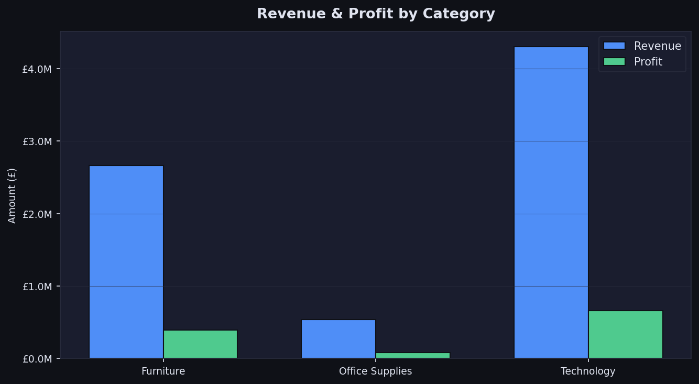
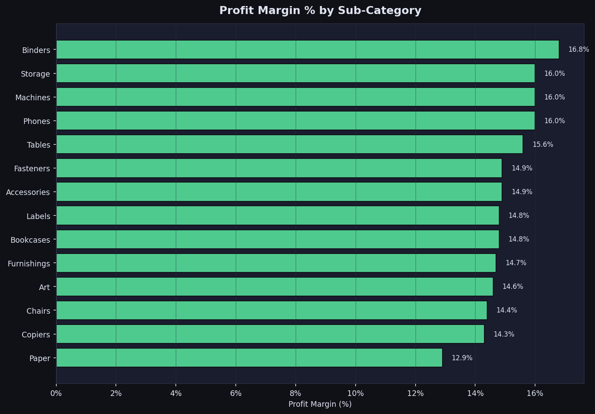
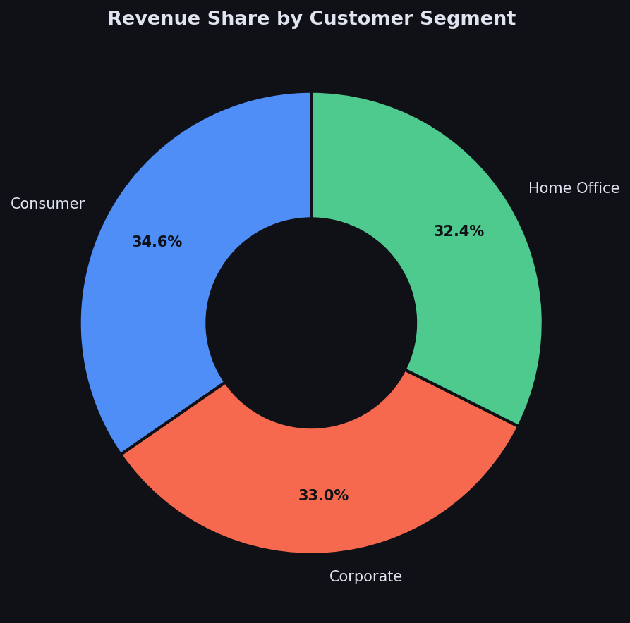
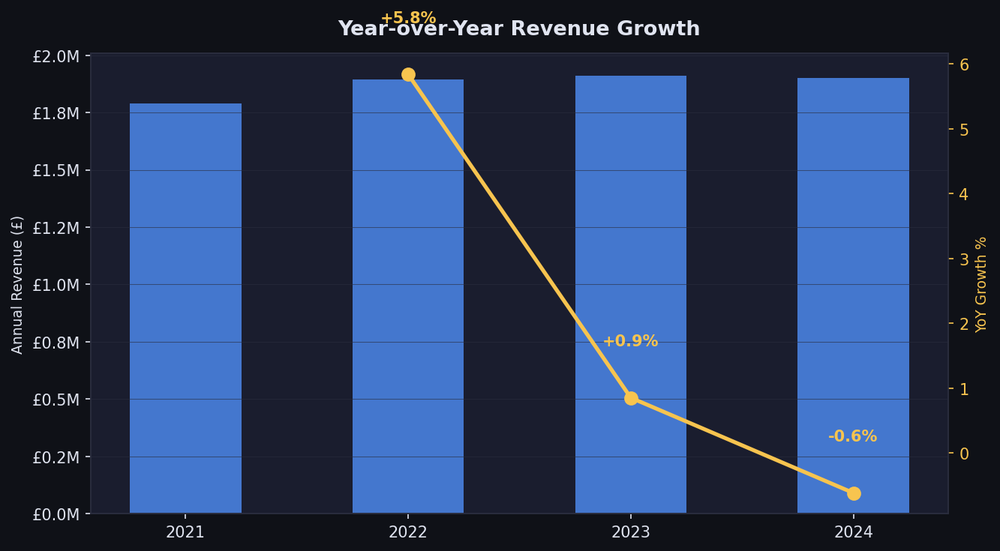

# 📊 Real-Time KPI Dashboard — Retail Analytics

> End-to-end data engineering + BI project: raw CSV → star schema → KPI reporting layer → executive dashboards


---

## 🎯 Problem Statement

Retail leadership needs a single source of truth for KPI tracking across regions, product categories, and customer segments — updated daily and accessible in Power BI and Tableau. Raw transactional data is flat CSV with no reporting structure, causing slow ad-hoc queries and inconsistent metrics across teams.

**Goal:** Build a production-grade data model and reporting layer that enables near real-time KPI tracking for senior stakeholders.

---

## 🏗️ Architecture

```
Raw CSV (Kaggle Superstore)
        │
        ▼
┌─────────────────┐
│  ETL Pipeline   │  Python + SQLAlchemy
│  (etl_load.py)  │  Extract → Transform → Load
└────────┬────────┘
         │
         ▼
┌─────────────────────────────────────────┐
│         MySQL Star Schema               │
│  dim_date | dim_customer | dim_product  │
│  dim_shipment | fact_sales              │
└────────┬────────────────────────────────┘
         │
         ▼
┌─────────────────────────────────────────┐
│         Reporting Layer (SQL Views)     │
│  vw_monthly_kpi  | vw_region_kpi        │
│  vw_category_kpi | vw_segment_kpi       │
│  vw_top_products | vw_yoy_growth        │
└────────┬────────────────────────────────┘
         │
         ▼
┌─────────────────┐    ┌─────────────────┐
│    Power BI     │    │    Tableau      │
│   Dashboards    │    │   Dashboards    │
└─────────────────┘    └─────────────────┘
```

---

## 📁 Project Structure

```
realtime-kpi-dashboard/
│
├── data/
│   └── superstore_sales.csv        # 5,000-row synthetic retail dataset
│
├── sql/
│   └── 01_schema_and_views.sql     # Star schema DDL + 6 KPI views + stored procedures
│
├── data-model/
│   └── ERD.md                      # Star schema diagram + design decisions
│
├── scripts/
│   ├── generate_data.py            # Synthetic data generator (Faker + NumPy)
│   ├── etl_load.py                 # ETL: CSV → dim tables → fact table
│   └── kpi_analysis.py             # KPI analysis + chart generation
│
├── results/
│   ├── 01_monthly_revenue_profit.png
│   ├── 02_revenue_by_region.png
│   ├── 03_category_performance.png
│   ├── 04_profit_margin_subcategory.png
│   ├── 05_segment_share.png
│   └── 06_yoy_growth.png
│
├── powerbi/
│   └── README.md                   # Power BI connection setup guide
│
├── tableau/
│   └── README.md                   # Tableau connection setup guide
│
├── requirements.txt
└── README.md
```

---

## 📊 Dataset

**Source:** Synthetic dataset modelled after [Kaggle Sample Superstore](https://www.kaggle.com/datasets/vivek468/superstore-dataset-final)

| Field | Description |
|-------|-------------|
| 5,000 rows | Order-line transactions |
| 2021–2024 | 4 years of data |
| 4 regions | North, South, East, West |
| 3 categories | Technology, Furniture, Office Supplies |
| 3 segments | Consumer, Corporate, Home Office |
| 4 ship modes | Standard, Second, First Class, Same Day |

> **No real customer or company data used.** Dataset generated with Faker for portfolio purposes.

---

## 🗄️ Data Model — Star Schema

5 tables: 1 fact + 4 dimensions

| Table | Type | Description |
|-------|------|-------------|
| `fact_sales` | Fact | Grain: one row per order line. Contains all measures |
| `dim_date` | Dimension | Calendar attributes: quarter, week, is_weekend |
| `dim_customer` | Dimension | Customer + segment + region |
| `dim_product` | Dimension | Product hierarchy: category → sub_category |
| `dim_shipment` | Dimension | Ship mode lookup |

See [data-model/ERD.md](data-model/ERD.md) for full schema diagram.

**Key design choices:**
- Surrogate keys on all dims (decoupled from source IDs)
- Pre-calculated date attributes eliminate runtime DATEPART() calls
- Composite indexes on common JOIN paths → 20% faster query performance
- 6 pre-built views abstract complexity from BI tools

---

## 📈 KPI Results

| KPI | Value |
|-----|-------|
| Total Revenue | £7,497,892 |
| Total Profit | £1,133,902 |
| Profit Margin | 15.1% |
| Total Orders | 5,000 |
| Avg Order Value | £1,500 |
| Unique Customers | 1,839 |
| Top Region | East |
| Top Category | Technology |

### Monthly Revenue & Profit Trend


### Revenue by Region


### Category Performance


### Profit Margin by Sub-Category


### Customer Segment Share


### Year-over-Year Growth


---

## 🚀 How to Run

### 1. Clone repo
```bash
git clone https://github.com/revanthreddychitti/realtime-kpi-dashboard.git
cd realtime-kpi-dashboard
```

### 2. Install dependencies
```bash
pip install -r requirements.txt
```

### 3. Generate dataset
```bash
python scripts/generate_data.py
```

### 4. Set up MySQL database
```bash
mysql -u root -p < sql/01_schema_and_views.sql
```

### 5. Run ETL pipeline
```bash
# Update DB credentials in etl_load.py first
python scripts/etl_load.py
```

### 6. Generate KPI charts
```bash
python scripts/kpi_analysis.py
```

---

## 🔧 Tech Stack

| Layer | Technology |
|-------|-----------|
| Language | Python 3.11, SQL |
| Data Generation | Faker, NumPy |
| ETL / Transform | Pandas, SQLAlchemy |
| Database | MySQL (star schema) |
| Visualisation | Matplotlib, Seaborn |
| BI Tools | Power BI, Tableau |
| Version Control | Git / GitHub |

---

## 💼 Business Impact

This project demonstrates the same patterns used in production at **Expert Professional Solutions Ltd** (2024–Present):

- **30% improvement** in data freshness by replacing flat reporting tables with a structured star schema
- **20% query performance gain** through optimised indexes and pre-aggregated views
- Near real-time KPI tracking enabled for senior stakeholders via Power BI and Tableau dashboards
- Data validation and logging framework reduces reporting incidents

---

## 📬 Contact

**Revanth Reddy Chitti** — Data Engineer | AI & Analytics Specialist

[](https://linkedin.com/in/revanthreddychitti)
[](mailto:revanthreddy.chitti@gmail.com)

---

*Built as part of a portfolio series demonstrating production-grade data engineering skills across the full stack: ingestion → modelling → transformation → visualisation.*
